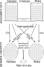

<section>

> Gender seems to be a current 'hot-button' topic in the media,
but when I actually stopped and thought,
it turned out I didn't really know much about it, what it means, and exactly how it relates to other aspects of sexuality.
I've been trying to rectify this with a bit of research,
and below is a summary of my current understanding in order to open it up to critique and improvement.

</section>

## Thinking along a spectrum

Most real world measurements that we might choose to make about people are likely to fall along a continuous scale.
For example,
we wouldn't arbitrarily group people into classes of either *tall* or *short*,
instead we would directly measure their height.
Based on this we may then choose to use some rule to group them;
such as -- everyone over 1.8 m is *tall*, everyone below is *short*.
This may be a useful simplification,
but it is understood that underlying the simple *tall*/*short* binary categories we have set up there may be a range of different heights.
In fact the difference between a *tall person* and a *short person* may only be a few centimetres;
the 1.8 m threshold that we have used is completely arbitrary and would not be appropriate for all populations.

This idea that behind group labels there are one or more measurements made along a continuous spectrum is something that I think provides a useful frame for thinking about gender issues.
I'm a very visual thinker, so if we took a hundred people and marked their height on a scale it might look something like this:

^[{-} One hundred people's height marked as a dash on a scale]

To make this clearer we can stack them up on top of one another,
which makes the distribution more obvious;
there are lots of people grouped around an average height,
with fewer people who are very tall or short.

^[{-} One hundred people's height as a distribution]

Not all distributions will look like this though.
There is no reason they need to be symmetrical,
or for them to have a single peak.

## Sex

We could take our same hundred people and measure them in a few different ways.
The measurements that are most relevant to discussing the sex of the people are:

* their number and type of sex chromosomes;
* their sex hormones;
* their type of gonads -- ovaries or testicles;
* their reproductive anatomy including their internal and external genitalia.

^[{-} 
One hundred people's sex measured along different scales]

The XX or XY chromosomes inherited during reproduction are a primary determinant of biological sex.
These are largely binary,
although there are some variations in these and in how they manifest during development.

Sex hormones,
androgens (including testosterone) and estrogens,
are produced by the body in varying quantities and have a major impact on determining sex, particularly during development.

The reproductive anatomy of a person develops based on their chromosomes and hormones.
Its size and occurrence can vary significantly,
with a range of 'ambiguous' genitalia between the accepted norms of *male* and *female*;
the Quigley scale is a descriptive, visual system for grading this into seven classes.

Although these separate aspects influence one another,
there is also substantial variation in the developmental process;
therefore it is necessary to measure each aspect independently as they will not necessarily correlate.
So if we consider individual people from our hundred then they may appear at a different point on each measurement scale.
Looking across all measurements it is then possible to separate our hundred people into two roughly equal size groups,
which we call *male* and *female*;
however there may be some people who don't fit neatly into either group,
either because they sit in the centre on several measures,
or because they sit in the *male* category on some measures and in the *female* category for others.
These people are referred to as *intersex* --
estimates are that between 0.05% and 1.7% of the population is born with intersex traits.

All of the above is based on biological differences,
and therefore the distinction between *male* and *female* is sometimes referred to as *biological sex*.
At birth the sex of a child is typically assigned to it based on observation.
Intersex babies may be assigned as *male* or *female*,
either incorrectly or arbitrarily;
they may also undergo surgery to 'correct' their sex.
Due to these practices the phrase *assigned sex* is also used.

## Gender identity

^[{-} 
How *assigned sex* relates to *gender identity*]

In ordinary speech *sex* and *gender* are often used interchangeably,
and indeed this was the defined meaning until the 1960s.
More recently though, the term *gender* has been used to refer to social and psychological differences between people.

There is evidence that male and female brains can differ,
with variation in a number of neurological areas.
This leads to the possibility of a mismatch between brain and body.

*Gender identity* refers to the sex a person's brain tells them they are.
Most typically this psychological *identity* aligns with their *assigned sex* --
this is referred to as being *cisgender*
(or simply *cis*).
Where  *identity* does not align with *assigned sex* a person is *transgender* (or *trans*).
An assigned male person who identifies as female is referred to as a *trans woman*,
or *male-to-female* (MTF).
Conversely, someone assigned as female but who identifies as male is called a *trans man*,
or *female-to-male* (FTM).
Some people don't feel either male or female,
which is often described as *non-binary*.
Such people may choose a label such as *genderqueer*, *gender variant*, or *gender fluid*.

It is important to note that the term *identity* does not imply any personal choice in the matter.
The significant distress a person can experience as a result of their *sex* and *gender* not matching is called *gender dysphoria*;
this may be alleviated through choosing to change some aspect of their body.
The more specific term *transexual* may be preferred by some people.

## Gender role

^[{-} 
One hundred people's gender role measured along different scales]

Societal expectations have developed regarding how each sex is supposed to appear and act.
These are referred to as *gender roles*,
and include things like how a person dresses, communicates, behaves, or grooms themselves.
We could choose to assess each of our hundred people on a scale from *masculine* to *feminine* for each of these things
(assuming a common societal culture).
We would expect a distribution of results in all cases,
with an individual person appearing at different points on each scale.

We can think of a *gender role* as being an aggregation of all these social expectations typically assigned to a man or woman.
A person may conform strongly or weakly to all aspects of a masculine or feminine gender role,
they might be ambiguously between on some,
or they could be masculine for some and feminine for others.
The term *gender non-conforming* may be used to describe people in these latter two groups
(*androgynous* and *cross dressing* are also specific terms for atypical gender roles).

Although the typical *gender roles* are defined relative to *sex*,
i.e. *males* are typically *masculine* and *females* are typically *feminine*,
*gender expression* refers to how an individual person expresses themself,
which need not align in this way.

It is important to note that both *cis* and *trans* people may express themselves differently to their *gender identity*.
For example,
being a feminine cis male does not imply that they are (or should be) a trans woman.
Likewise,
it is totally possible to be a masculine trans woman.
In other words,
*gender expression* is separate from *gender identity*.

## Sexuality

It should be noted that all of the above makes no statement about a persons *sexual orientation*,
in that it only relates to a person's biology, how they feel about themself, and how they express themself.
A person of any sex and gender may be romantically or sexually attracted to another person of any sex or gender;
the nature of that attraction is referred to as their *orientation*.
Sexual orientation may be considered a continuum ranging from exclusive attraction to the opposite sex to exclusive attraction to the same sex.

^[{-} 
Different sexual orientations]

The most common case of a man attracted to women,
or a woman attracted to men,
is referred to as *heterosexuality*
(or being *straight*).
Same sex attraction is generally called *homosexuality*,
or being *gay*,
with the specific term *lesbian* for women attracted to women.
*Bisexuality* is romantic or sexual attraction to both men and women.

Other descriptions that may be used include *pansexual*,
which rejects the the notion of binary genders,
and *asexual*,
where there is a lack of sexual attraction to others of any sex.
The term *questioning* is also sometimes used to describe those who are unsure of their sexual orientation and do not wish to select a label.

Although sex and gender are often used interchangeably when discussing a person's orientation,
transgender people typically take the orientation label that corresponds with their own gender identity;
i.e. a trans woman who is solely attracted to women would identify as a lesbian.

## Wrap up

Although I had a sort of vague notion of most of the above before looking into it,
I don't think I could have properly separated out the terminology.

I think very visually,
so I put together the figures above to document the picture that I now have in my head.
Of course there are lots of other ways these issues could be drawn out,
but perhaps this view is useful to others?

## Disclaimers

* I'm not an expert.
* Science and language are continually evolving.
* Distributions are to demonstrate the concept only, they are not based on anything other than vague guesswork (actual data welcomed!).
* All diagrams should be considered simplifications.
For example, it is totally possible for a *non-binary* person to be *bisexual*, but the drawing gets quite messy.

## Credits

* Diagrams are drawn by me in [Inkscape](https://inkscape.org/).
* Text is written by me, based on a variety of sources on the web.
* The font in the diagrams is [xkcd](https://xkcd.com/) author [Randal Munroe's handwriting](https://cdn.rawgit.com/ipython/xkcd-font/master/preview.html), the main body text font is [Playtime With Hot Toddies](https://www.fontsquirrel.com/fonts/playtime-with-hot-toddies).
* The style of the page is a modified version of [Tufte CSS](https://edwardtufte.github.io/tufte-css/).
* This document is written in markdown and then converted to HTML using [Tufte Pandoc CSS](https://jez.io/tufte-pandoc-css/).
* Original [Quigley scale drawings](https://en.wikipedia.org/wiki/File:Quigley_scale_for_androgen_insensitivity_syndrome.jpg) by Jonathan Marcus.
* SVG graphics are included interactively using [SVGInjector](https://github.com/iconic/SVGInjector).
* This work is not directly influenced by [The GenderBread Person](https://itspronouncedmetrosexual.com/2012/03/the-genderbread-person-v2-0/) or [The Gender Unicorn](http://www.transstudent.org/gender/), however some similarities are acknowledged.
